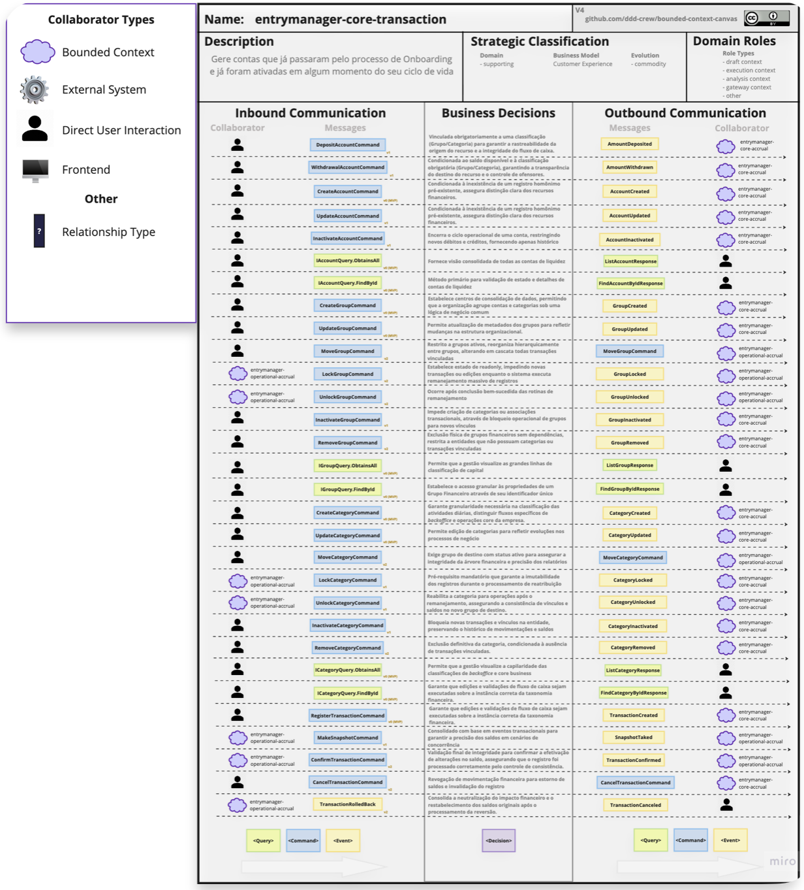
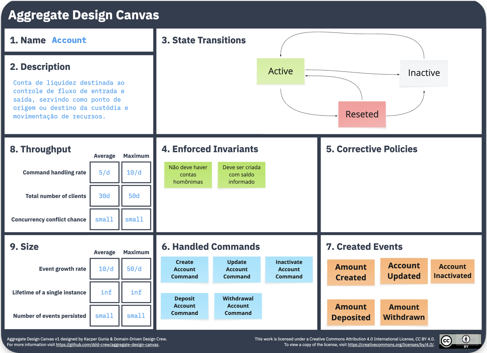

## 📖 Índice

-   [🚀 Get Started]((#-como-executar-o-projeto-quick-start))

-   [📋 Fluxo de Teste Sugerido](#fluxo-de-teste-sugerido)

-   [⚡ Desafio de Performance](#desafio-de-performance-stress-test)

-   [🔍 Validação e Monitoramento](#validacao-e-monitoramento-dos-dados)

-   [📚 Parando o Ambiente](#parando-o-ambiente)

-   [⚠️ Débitos Técnicos e Roadmap](#debitos-tecnicos-roadmap)

-   [🗺️ DDocumentação Técnica](#documentacao-tecnica)

----------
# 🛠️ Como Executar o Projeto (Quick Start)

A forma mais rápida e recomendada de rodar o ecossistema completo (APIs, Redis e Kafka) é utilizando o **Docker**. Com apenas alguns comandos, todo o ambiente de mensageria e cache será configurado automaticamente.


## 1. Pré-requisitos

Certifique-se de ter instalado em sua máquina:

-   **[Docker Desktop](https://www.docker.com/products/docker-desktop/)** (Windows ou macOS) ou **Docker Engine** (Linux).

-   **[Git](https://git-scm.com/book/pt-pt/v2/Come%C3%A7ando-Instalar-o-Git)** para clonar o repositório.


## 2. Subindo o Ambiente

Abra o terminal na raiz de um diretório de sua escolha e execute os seguintes comandos:

Bash
```
# 1. Clone o repositório
git clone https://github.com/seu-usuario/entry-manager.git
cd entry-manager

# 2. Suba todos os serviços (APIs + Infra)
docker compose up --build
```
> **O que o Docker fará por você?**
>
> -   Compilará as APIs **entrymanager-core-transaction** e **entrymanager-core-accrual** utilizando o [.NET SDK 10](https://dotnet.microsoft.com/pt-br/download).
>
> -   Configurará o **Mongo** para persistência ultra rápida de dados.
>
> -   Configurará o **Kafka** para a comunicação instantânea entre os serviços  via eventos.
>
> -   Subirá uma instância do **Redis** para o cache do motor de Rollup.


## 3. Verificando a execução

Após o log do console estabilizar, você poderá acessar as APIs nos seguintes endereços:

-   **Transaction API:** `http://localhost:5104/swagger`

-   **Accrual API:** `http://localhost:5105/swagger`

----------
# 🧪 Fluxo de Teste Sugerido

Para facilitar os testes, o projeto inclui uma **Postman Collection** e um **Environment** pré-configurados.

### 1. Utilizando Postman

1. Instale o **[Postman](https://www.postman.com/downloads/)** caso não tenha
1.  Abra o Postman.
2.  Clique em **Import**, no canto superior esquerdo, e selecione os arquivos localizados na pasta `/postman` na raiz do projeto:

    -   `entry-manager.postman_collection.json`
    -   `[LOCAL] entry-manager.postman_environment.json`

3.  No canto superior direito do Postman, selecione o ambiente **"[LOCAL] entry-manager"**.


### 2. Fluxo de Execução Obrigatório (Primeira Carga)

Para que os serviços funcionem corretamente, os registros iniciais devem ser criados seguindo a hierarquia de dependências do domínio. A Collection do Postman já está organizada de cima para baixo para facilitar este processo.

> [!IMPORTANT] **Siga a ordem estrita abaixo na primeira execução:** > O ID gerado em uma requisição é necessário para compor o relacionamento da próxima.

1.  **core-transaction/Financial Account (`POST`):** Cria a conta base. Copie o `id` retornado.

2.  **core-transaction/Financial Group (`POST`):** Cria o grupo econômico, informando o `accountId` criado no passo anterior.

3.  **core-transaction/Financial Category (`POST`):** Cria a categoria (ex: Alimentação, Transporte), vinculando-a ao `groupId`.

4.  **core-transaction/Transaction (`POST`):** Registra a movimentação financeira utilizando o `categoryId`.

5. **core-accrual/Daily Consolidated Rollup (`GET`):** Visualiza o balanço consolidado no Redis para o dia especificado.

6.  **core-accrual/Reset Daily Rollup (`PUT`):** Limpa o cache do Redis e força a reidratação dos dados a partir do MongoDB.


----------

# ⚡ Desafio de Performance (Stress Test)

O motor de processamento foi desenhado para ser extremamente leve e resiliente. Gostaria de encorajar você a testar os limites da solução:

-   **O Teste Recomendado:** Execute um teste de carga no endpoint **Daily Consolidated Rollup** com **50 reqs/s**. Graças ao cache otimizado no Redis, a resposta deve ser quase instantânea.

-   **O Desafio:** Tente estender esse teste para os demais endpoints (Criação e Listagem). Embora eles não possuam cache (leitura/escrita direta no MongoDB e disparo de eventos Kafka), a execução foi otimizada para ser surpreendentemente rápida.

**Se você realizar esses testes, adoraria receber o seu feedback!** O comportamento do sistema sob carga, mesmo em fluxos que não possuem cache, é um caso de uso que superou as expectativas iniciais de performance.

**Flexibilidade de Dados:** Uma vez que você possua uma base de dados inicial, terá total liberdade para alternar entre os IDs existentes e criar novas combinações. O rigor inicial serve apenas para garantir a integridade referencial e o correto "aquecimento" do cache no Redis.


# 🔍 Validação e Monitoramento dos Dados

Para auxiliar na depuração e garantir que os eventos e registros estão sendo processados corretamente, o ambiente Docker já inclui ferramentas de interface visual (GUI) pré-configuradas.

### 1. Eventos em Tempo Real (Kafka UI)

O **Kafka UI** permite monitorar o fluxo de mensagens entre as APIs. É ideal para validar se os eventos `AccountWasCreated` e  `TransactionWasCreated` foram disparados com sucesso.

-   **Acesso:** `http://localhost:8080`

-   **O que observar:** Verifique o tópico de transações e visualize o conteúdo (payload) das mensagens conforme você executa as requisições no Postman.


### 2. Persistência de Dados (Mongo Express)

O **Mongo Express** é uma interface leve para inspecionar o banco de dados NoSQL onde as transações e entidades são armazenadas de forma definitiva.

-   **Acesso:** `http://localhost:8081`

-   **O que observar:** Navegue pelas collections de `Accounts`, `Groups`, `Categories` e `Transactions` para garantir que a persistência seguiu a hierarquia correta.


### 3. Cache e Performance (Redis Insight)

O **Redis Insight** é a interface oficial para visualizar os dados em memória. O serviço Accrual é o motor de cálculo e utiliza o Redis para garantir performance e atomicidade, esta ferramenta é essencial para validar o estado do cache.

-   **Acesso:** `http://localhost:8001`

-   **O que observar:** Veja o motor de Rollup em ação! Inspecione os hashes diários e os índices que o sistema cria dinamicamente para cada grupo e categoria.


----------
# 🛑 Parando o Ambiente

Para encerrar os serviços e liberar memória, use `Ctrl + C` no terminal onde o Docker está rodando ou execute:

Bash

```
docker compose down

```

----------
# ⚠️ Débitos Técnicos & Roadmap

Este projeto é um MVP (Mínimo Produto Viável) focado na engine de processamento atômico de Rollups. Como tal, possui algumas limitações conhecidas que estão no radar para futuras evoluções:

### 1. Sincronização de Dados

-   **Fluxo Unidirecional:** A comunicação atual é exclusivamente do `Core Transaction` para o `Core Accrual`.

-   **Gatilhos de Sincronia:** * **Contas:** Sincronizadas apenas no momento da criação.

    -   **Grupos e Categorias:** Atualmente, são refletidos no motor de Accrual apenas quando a primeira transação vinculada a eles é processada.

-   **Updates Pendentes:** Alterações em nomes de categorias, grupos ou configurações de conta realizadas no `Core Transaction` ainda não são propagadas automaticamente para o motor de `Accrual`.


### 2. Motor de Consolidação (Rollup)

-   **Atualização Dinâmica:** Atualmente, o consolidado diário é gerado com base no estado do banco de dados no momento da **primeira transação do dia** recebida pelo Accrual.

-   **Reidratação de Cache:** Caso novas transações sejam geradas retroativamente ou em massa via banco, é necessário executar o endpoint de **Reset de Rollup** para forçar a recarga dos dados do MongoDB para o Redis.


### 3. Recomendações de Uso

Para garantir a melhor experiência de teste:

1.  Realize toda a carga de dados cadastrais (**Accounts, Groups, Categories**) primeiro.

2.  Valide as listagens e detalhes dessas entidades.

3.  Só então inicie o envio de **Transactions** para observar o comportamento do motor de cálculo.


# Documentação Técnica

Este diretório centraliza a modelagem técnica do sistema, estruturada para garantir alta coesão e independência entre os serviços financeiros através de Domain-Driven Design (DDD).

## Mapa da Jornada (User Story Map)
O User Story Map abaixo descreve a experiência completa do usuário, desde a abertura de contas até a gestão de grupos e o fechamento de períodos financeiros. Este artefato serve como guia para a priorização de todas as funcionalidades dos serviços.


## Core Transaction
Responsável pela imutabilidade e persistência de cada evento financeiro.

### Bounded Context Canvas 
Define as fronteiras do motor de transações e sua linguagem ubíqua.



### Aggregate Model Canvas

Detalha a entidade Transaction, suas invariantes e comandos de confirmação/cancelamento.



Foco: Imutabilidade e Auditoria.


### 🗺️ Desenho da Solução
Você pode visualizar o diagrama interativo da arquitetura através do link abaixo:
👉 **[Diagrama da Solução no Excalidraw](https://excalidraw.com/#json=JCnXmxfuYY8-euaBDYAMV,edVncsK0Qwtx64JDXrkb-g)**